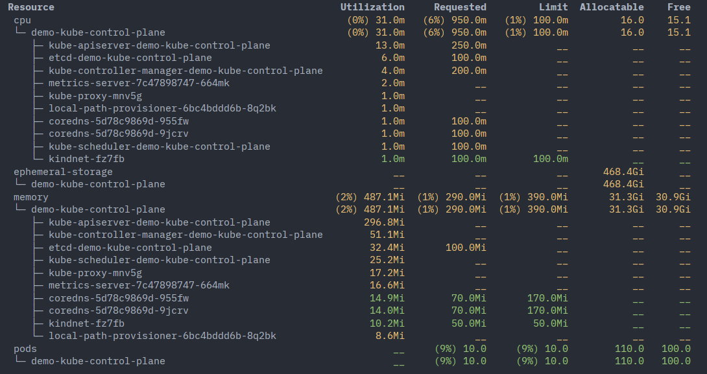

# kubectl-view-allocations

[](http://creativecommons.org/publicdomain/zero/1.0/)
[](https://crates.io/crates/kubectl-view-allocations)
[](https://www.repostatus.org/#active)
[](https://github.com/davidB/kubectl-view-allocations/actions)
[](https://docs.rs/kubectl-view-allocations/)
[](https://crates.io/crates/kubectl-view-allocations)


`kubectl` plugin for visualizing resource allocations across your cluster. Key differentiators:

- **All resources** — cpu, memory, gpu, and any custom resource; not limited to cpu/memory like most tools
- **Tree view** — group and aggregate by resource, node, namespace, or pod in any combination via `-g`
- **Full picture** — requested, limit, allocatable, free, and optionally live utilization (`-u`, requires metrics-server)

```sh
kubectl view-allocations -u
```



> **Note:** By default only nodes *without* taints are shown. If results look empty or incomplete, use `--ignore-taints` to include control-plane or tainted nodes — see [Filter by Node Taints](#filter-by-node-taints).

| Column | Description |
|---|---|
| `Requested` | Resources requested by containers in pod manifests, summed by pod/namespace/node. Includes percentage of the group's allocatable total. |
| `Limit` | Max resources (limit) set in pod manifests, summed by pod/namespace/node. Includes percentage of the group's allocatable total. |
| `Allocatable` | Allocatable resources defined (or detected) on nodes. |
| `Free` | `Allocatable - max(Limit, Requested)` by default — see `--used-mode` to change this. |
| `Utilization` | Actual cpu/memory usage from the Metrics API. Disabled by default; requires [metrics-server](https://github.com/kubernetes-incubator/metrics-server) on the cluster. |

## Table of Contents

- [Install](#install) — krew · mise · binary · cargo
- [Usage](#usage)
  - [Overview only](#overview-only)
  - [Show GPU allocation](#show-gpu-allocation)
  - [Show utilization](#show-utilization)
  - [Group by namespaces](#group-by-namespaces)
  - [Show as CSV](#show-as-csv)
  - [Filter by node taints](#filter-by-node-taints)
  - [Full option reference](#full-option-reference)
- [Alternatives](#alternatives)
- [Sponsors](#sponsors)

## Install

**Recommended:** [krew](https://krew.sigs.k8s.io/) is the easiest way to install and keep the plugin up to date.

**krew**
```sh
kubectl krew install view-allocations
```

**mise** (GitHub releases backend)
```sh
mise use -g github:davidB/kubectl-view-allocations
```

**binary** — download from [GitHub releases](https://github.com/davidB/kubectl-view-allocations/releases/latest) or via script:
```sh
curl https://raw.githubusercontent.com/davidB/kubectl-view-allocations/master/scripts/getLatest.sh | bash
```

**cargo**
```sh
cargo install kubectl-view-allocations
```

## Usage

All examples use `kubectl-view-allocations` directly; if installed via krew, substitute `kubectl view-allocations`.

### Overview only

```sh
> kubectl-view-allocations -g resource

 Resource              Requested          Limit  Allocatable     Free
  cpu                 (21%) 56.7    (65%) 176.1        272.0     95.9
  ephemeral-storage     (0%)  __       (0%)  __        38.4T    38.4T
  memory             (8%) 52.7Gi  (15%) 101.3Gi      675.6Gi  574.3Gi
  nvidia.com/gpu      (71%) 10.0     (71%) 10.0         14.0      4.0
  pods                (9%) 147.0     (9%) 147.0         1.6k     1.5k
```

### Show GPU allocation

```sh

> kubectl-view-allocations -r gpu

 Resource                   Requested       Limit  Allocatable  Free
  nvidia.com/gpu           (71%) 10.0  (71%) 10.0         14.0   4.0
  ├─ node-gpu1               (0%)  __    (0%)  __          2.0   2.0
  ├─ node-gpu2               (0%)  __    (0%)  __          2.0   2.0
  ├─ node-gpu3             (100%) 2.0  (100%) 2.0          2.0    __
  │  └─ fah-gpu-cpu-d29sc         2.0         2.0           __    __
  ├─ node-gpu4             (100%) 2.0  (100%) 2.0          2.0    __
  │  └─ fah-gpu-cpu-hkg59         2.0         2.0           __    __
  ├─ node-gpu5             (100%) 2.0  (100%) 2.0          2.0    __
  │  └─ fah-gpu-cpu-nw9fc         2.0         2.0           __    __
  ├─ node-gpu6             (100%) 2.0  (100%) 2.0          2.0    __
  │  └─ fah-gpu-cpu-gtwsf         2.0         2.0           __    __
  └─ node-gpu7             (100%) 2.0  (100%) 2.0          2.0    __
     └─ fah-gpu-cpu-x7zfb         2.0         2.0           __    __
```

### Show utilization

- Utilization information are retrieved from [metrics-server](https://github.com/kubernetes-incubator/metrics-server) (should be setup on your cluster).
- Only reports cpu and memory utilization.

```sh
> kubectl-view-allocations -u

 Resource                                                 Utilization     Requested         Limit  Allocatable    Free
  cpu                                                      (0%) 31.0m   (6%) 950.0m   (1%) 100.0m         16.0    15.1
  └─ demo-kube-control-plane                               (0%) 31.0m   (6%) 950.0m   (1%) 100.0m         16.0    15.1
     ├─ kube-apiserver-demo-kube-control-plane                  13.0m        250.0m            __           __      __
     ├─ etcd-demo-kube-control-plane                             6.0m        100.0m            __           __      __
     ├─ kube-controller-manager-demo-kube-control-plane          4.0m        200.0m            __           __      __
     ├─ metrics-server-7c47898747-664mk                          2.0m            __            __           __      __
     ├─ kube-proxy-mnv5g                                         1.0m            __            __           __      __
     ├─ local-path-provisioner-6bc4bddd6b-8q2bk                  1.0m            __            __           __      __
     ├─ coredns-5d78c9869d-955fw                                 1.0m        100.0m            __           __      __
     ├─ coredns-5d78c9869d-9jcrv                                 1.0m        100.0m            __           __      __
     ├─ kube-scheduler-demo-kube-control-plane                   1.0m        100.0m            __           __      __
     └─ kindnet-fz7fb                                            1.0m        100.0m        100.0m           __      __
  ephemeral-storage                                                __            __            __      468.4Gi      __
  └─ demo-kube-control-plane                                       __            __            __      468.4Gi      __
  memory                                                 (2%) 487.1Mi  (1%) 290.0Mi  (1%) 390.0Mi       31.3Gi  30.9Gi
  └─ demo-kube-control-plane                             (2%) 487.1Mi  (1%) 290.0Mi  (1%) 390.0Mi       31.3Gi  30.9Gi
     ├─ kube-apiserver-demo-kube-control-plane                296.8Mi            __            __           __      __
     ├─ kube-controller-manager-demo-kube-control-plane        51.1Mi            __            __           __      __
     ├─ etcd-demo-kube-control-plane                           32.4Mi       100.0Mi            __           __      __
     ├─ kube-scheduler-demo-kube-control-plane                 25.2Mi            __            __           __      __
     ├─ kube-proxy-mnv5g                                       17.2Mi            __            __           __      __
     ├─ metrics-server-7c47898747-664mk                        16.6Mi            __            __           __      __
     ├─ coredns-5d78c9869d-955fw                               14.9Mi        70.0Mi       170.0Mi           __      __
     ├─ coredns-5d78c9869d-9jcrv                               14.0Mi        70.0Mi       170.0Mi           __      __
     ├─ kindnet-fz7fb                                          10.2Mi        50.0Mi        50.0Mi           __      __
     └─ local-path-provisioner-6bc4bddd6b-8q2bk                 8.6Mi            __            __           __      __
  pods                                                             __     (9%) 10.0     (9%) 10.0        110.0   100.0
  └─ demo-kube-control-plane                                       __     (9%) 10.0     (9%) 10.0        110.0   100.0
```

### Group by namespaces

```sh
> kubectl-view-allocations -g namespace

 Resource               Requested         Limit  Allocatable   Free
  cpu                (10%) 200.0m            __          2.0    1.8
  └─ kube-system           200.0m            __           __     __
  ephemeral-storage            __            __        99.8G     __
  memory             (2%) 140.0Mi  (3%) 170.0Mi        5.8Gi  5.6Gi
  └─ kube-system          140.0Mi       170.0Mi           __     __
  pods                   (5%) 5.0      (5%) 5.0        110.0  105.0
  └─ kube-system              5.0           5.0           __     __
```

### Show as CSV

Values are expanded as floats (with 2 decimal places).

```sh
kubectl-view-allocations -o csv
Date,Kind,resource,node,pod,Requested,%Requested,Limit,%Limit,Allocatable,Free
2020-08-19T19:12:48.326605746+00:00,resource,cpu,,,59.94,22%,106.10,39%,272.00,165.90
2020-08-19T19:12:48.326605746+00:00,node,cpu,node-gpu1,,2.31,19%,4.47,37%,12.00,7.53
2020-08-19T19:12:48.326605746+00:00,pod,cpu,node-gpu1,yyy-b8bd56fbd-5x8vq,1.00,,2.00,,,
2020-08-19T19:12:48.326605746+00:00,pod,cpu,node-gpu1,kube-flannel-ds-amd64-7dz9z,0.10,,0.10,,,
2020-08-19T19:12:48.326605746+00:00,pod,cpu,node-gpu1,node-exporter-gpu-b4w7s,0.11,,0.22,,,
2020-08-19T19:12:48.326605746+00:00,pod,cpu,node-gpu1,xxx-backend-7d84544458-46qnh,1.00,,2.00,,,
2020-08-19T19:12:48.326605746+00:00,pod,cpu,node-gpu1,weave-scope-agent-bbdnz,0.10,,0.15,,,
2020-08-19T19:12:48.326605746+00:00,node,cpu,node-gpu2,,0.31,1%,0.47,2%,24.00,23.53
2020-08-19T19:12:48.326605746+00:00,pod,cpu,node-gpu2,kube-flannel-ds-amd64-b5b4v,0.10,,0.10,,,
2020-08-19T19:12:48.326605746+00:00,pod,cpu,node-gpu2,node-exporter-gpu-796jz,0.11,,0.22,,,
2020-08-19T19:12:48.326605746+00:00,pod,cpu,node-gpu2,weave-scope-agent-8rhnd,0.10,,0.15,,,
2020-08-19T19:12:48.326605746+00:00,node,cpu,node-gpu3,,3.41,11%,6.67,21%,32.00,25.33
...
```

Can be combined with `--group-by`:

```sh
kubectl-view-allocations -g resource -o csv
Date,Kind,resource,Requested,%Requested,Limit,%Limit,Allocatable,Free
2020-08-19T19:11:49.630864028+00:00,resource,cpu,59.94,22%,106.10,39%,272.00,165.90
2020-08-19T19:11:49.630864028+00:00,resource,ephemeral-storage,0.00,0%,0.00,0%,34462898618662.00,34462898618662.00
2020-08-19T19:11:49.630864028+00:00,resource,hugepages-1Gi,0.00,,0.00,,,
2020-08-19T19:11:49.630864028+00:00,resource,hugepages-2Mi,0.00,,0.00,,,
2020-08-19T19:11:49.630864028+00:00,resource,memory,69063409664.00,10%,224684670976.00,31%,722318667776.00,497633996800.00
2020-08-19T19:11:49.630864028+00:00,resource,nvidia.com/gpu,3.00,27%,3.00,27%,11.00,8.00
2020-08-19T19:11:49.630864028+00:00,resource,pods,0.00,0%,0.00,0%,1540.00,1540.00
```

### Filter by Node Taints

By default, `kubectl-view-allocations` only shows nodes without taints (workload nodes). The `--ignore-taints` option allows you to control which nodes are included based on their taints.

```sh
# Default: Only show nodes without taints (workload nodes)
kubectl-view-allocations

# Ignore all taints and show all nodes (including control-plane)
kubectl-view-allocations --ignore-taints

# Show untainted nodes + nodes with specific taints (ignore these taints)
kubectl-view-allocations --ignore-taints node-role.kubernetes.io/control-plane

# Show untainted nodes + nodes with specific taint key-value pairs
kubectl-view-allocations --ignore-taints dedicated=database

# Ignore multiple taint patterns
kubectl-view-allocations --ignore-taints node-role.kubernetes.io/control-plane,dedicated=database

# Combine with label selector
kubectl-view-allocations -l environment=production --ignore-taints dedicated=database
```

**Use cases:**
- **Default behavior**: Show only workload nodes (nodes without taints) for typical application resource allocation
- **Complete overview**: Use `--ignore-taints` without values to see all nodes in the cluster, including control-plane and specialized nodes
- **Include control-plane**: Use `--ignore-taints node-role.kubernetes.io/control-plane` to see workload + control-plane nodes
- **Include specialized nodes**: Use `--ignore-taints dedicated,workload` to include dedicated or workload-specific nodes alongside regular workload nodes

### Full option reference

```sh
> kubectl-view-allocations -h
kubectl plugin to list allocations (cpu, memory, gpu,...) X (utilization, requested, limit, allocatable,...)

Usage: kubectl-view-allocations [OPTIONS]

Options:
      --kubeconfig <KUBECONFIG>
          Path to the kubeconfig file to use for requests to kubernetes cluster
      --context <CONTEXT>
          The name of the kubeconfig context to use
  -n, --namespace <NAMESPACE>...
          Filter pods by namespace(s), by default pods in all namespaces are listed (comma separated list or multiple calls)
  -l, --selector <SELECTOR>
          Show only nodes match this label selector
      --ignore-taints [<IGNORE_TAINTS>...]
          Ignore nodes with specific taints; when not specified, only nodes without taints are shown; when used without values, show all nodes (comma-separated list)
  -u, --utilization
          Force to retrieve utilization (for cpu and memory), requires having metrics-server https://github.com/kubernetes-sigs/metrics-server
  -z, --show-zero
          Show lines with zero requested AND zero limit AND zero allocatable, OR pods with unset requested AND limit for `cpu` and `memory`
      --used-mode <USED_MODE>
          The way to compute the `used` part for free (`allocatable - used`) [default: max-request-limit] [possible values: max-request-limit, only-request]
      --precheck
          Pre-check access and refresh token on kubeconfig by running `kubectl cluster-info`
      --accept-invalid-certs
          Accept invalid certificates (dangerous)
  -r, --resource-name <RESOURCE_NAME>...
          Filter resources shown by name(s), by default all resources are listed (comma separated list or multiple calls)
  -g, --group-by <GROUP_BY>...
          Group information in a hierarchical manner; defaults to `-g resource,node,pod` (comma-separated list or multiple calls) [possible values: resource, node, pod, namespace]
  -o, --output <OUTPUT>
          Output format [default: table] [possible values: table, csv]
  -s, --sort <SORT>
          Sort rows by column(s), SQL-like syntax: 'col [ASC|DESC]' (comma-separated). Valid columns: usage/utilization, requested, limits/limit, allocatable, free, name. Direction is optional (default ASC). name ASC is always the implicit final tiebreaker [default: "usage DESC, requested DESC, limits DESC, name ASC"]
  -h, --help
          Print help
  -V, --version
          Print version

https://github.com/davidB/kubectl-view-allocations
```

## Alternatives & Similars

- see the discussion [Need simple kubectl command to see cluster resource usage · Issue #17512 · kubernetes/kubernetes](https://github.com/kubernetes/kubernetes/issues/17512)
- For CPU & Memory only
  - [ahmetb/kubectl-node_resource: Query node allocations/utilization in kubectl](https://github.com/ahmetb/kubectl-node_resource)
  - [robscott/kube-capacity: A simple CLI that provides an overview of the resource requests, limits, and utilization in a Kubernetes cluster](https://github.com/robscott/kube-capacity),
  - [hjacobs/kube-resource-report: Report Kubernetes cluster and pod resource requests vs usage and generate static HTML](https://github.com/hjacobs/kube-resource-report)
  - [etopeter/kubectl-view-utilization: kubectl plugin to show cluster CPU and Memory requests utilization](https://github.com/etopeter/kubectl-view-utilization)
- For CPU & Memory utilization only
  - `kubectl top pods`
  - [LeastAuthority/kubetop: A top(1)-like tool for Kubernetes.](https://github.com/LeastAuthority/kubetop)
- As a Rust library
  - [kdash-rs/kdash](https://crates.io/crates/kdash) embeds `kubectl-view-allocations` as a dependency. To use it in your own Rust project: `kubectl-view-allocations = { version = "1.1.0", default-features = false }` (add `k8s-openapi/vX_YY` to your features).
- Via AI assistant (no binary needed)
  - If your AI coding tool supports [skills.sh](https://skills.sh), install the assistant workflow with `npx skills add davidB/kubectl-view-allocations`. This lets your AI agent run and interpret `kubectl view-allocations` for you — it does not install the binary.

## Sponsors

[Alchim312 | CDviz](https://cdviz.dev) — SDLC observability platform built on CDEvents.

Download history (weekly, powered by [CDviz download-history](https://download-history.cdviz.dev)):


